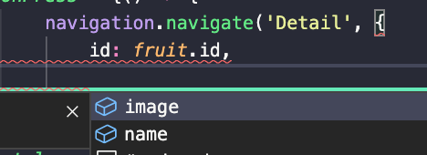

<p align="center">
  
  
  
  
</p>

# Fruits App

Snack Expo: https://snack.expo.io/4ZbqBY4a-

> Projek Contoh Untuk Passing Parameter Pada Navigasi di React-Native Menggunakan TypeScript

<p align="center">
  
  
</p>

# Catatan

Projek ini di init menggunakan perintah ```npx react-native init fruits_app --template react-native-template-typescript``` menggunakan **Node.js 15.5.0**

# Running Project

- ```git clone https://github.com/crocodication/fruits_app.git```
- ```cd fruits_app```
- ```npm install```

Jika menggunakan MacOS, lakukan juga

- ```cd ios; pod install; cd ..```

Kemudian

- ```npx react-native run-android``` / ```npx react-native run-ios```

# Tujuan 

Semoga dengan sample project ini bisa mengambil poin - poin sebagai berikut

- Pemetaan Type untuk parameter saat navigasi, berguna untuk memunculkan suggest auto-complete parameter pada pemanggilan fungsi navigasi



beserta suggest auto-complete pilihan parameter dari layar itu sendiri yang mana yang bisa diambil setelah di passing

